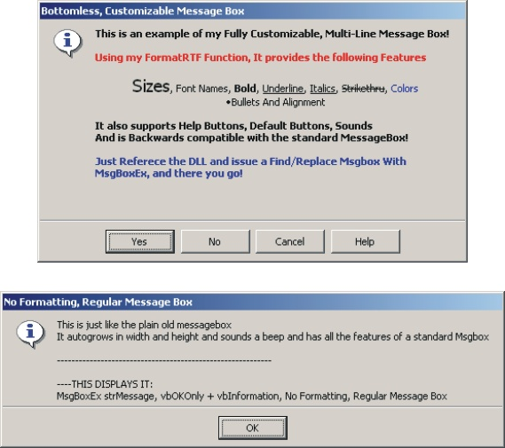



## Advanced Message Box DLL \- Fully Customizable \- See Screen Shots

### Description

This is a fully customizable message box that is backwards compatible with the standard microsoft message box. It has 3 additional parameters that tell it whether to autosize and what size to be. Using my FormatRTF function..which is also posted seperately on PSCODE, you can include tags to format the text any way you would like (see screen shots). There are no limits to the uses of this box. It can be used as both a Regular or Bottomless Message Box and Includes the ability to set Default Button and the Help Button. It is a function and will return integer values that can be compared to vb constants (ie: vbok, vbretry) so you can determine what the user clicked. It is vaguely commented (if that) because I just decided to throw it up here. If you don't understand it, Now is a good time to Learn!! Hope someone finds this as usefull as I have...(Comments and Enhancement Requests Welcome) - ENJOY!!
 
### More Info
 

             |
---                |---
**Submitted On**   |2002-01-20 08:52:04
**By**             |[Patrick Daniel](https://github.com/Planet-Source-Code/PSCIndex/blob/master/ByAuthor/patrick-daniel.md)
**Level**          |Advanced
**User Rating**    |4.5 (58 globes from 13 users)
**Compatibility**  |VB 4\.0 \(32\-bit\), VB 5\.0, VB 6\.0
**Category**       |[Custom Controls/ Forms/  Menus](https://github.com/Planet-Source-Code/PSCIndex/blob/master/ByCategory/custom-controls-forms-menus__1-4.md)
**World**          |[Visual Basic](https://github.com/Planet-Source-Code/PSCIndex/blob/master/ByWorld/visual-basic.md)
**Archive File**   |[Advanced\_M500141202002\.zip](https://github.com/Planet-Source-Code/patrick-daniel-advanced-message-box-dll-fully-customizable-see-screen-shots__1-30977/archive/master.zip)

